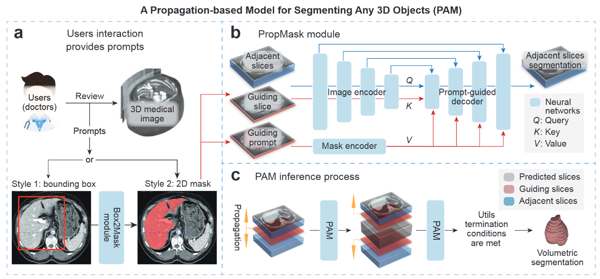

# PAM: A Propagation-Based Model for Segmenting Any 3D Objects across Multi-Modal Medical Images

[[Paper]](https://arxiv.org/abs/2408.13836)  [[Google Drive]]([https://drive.google.com/drive/folders/10fi5ZLFRnW5lCMVI7vMY61eTfOQlN9oI?usp=share_link](https://drive.google.com/drive/folders/10fi5ZLFRnW5lCMVI7vMY61eTfOQlN9oI?usp=share_link))  [[Baidu Pan]]([https://pan.baidu.com/s/1WdTPG_ojCEeWR5qpl2_WzQ?pwd=mksh](https://pan.baidu.com/s/1WdTPG_ojCEeWR5qpl2_WzQ?pwd=mksh))

PAM (Propagation-based Anything Model) is a general-purpose framework that produces volumetric 3D segmentations from a  minimal 2D prompt . It works across multi-modal medical images including CT, MRI, PET, SRX, micro-CT, and more—without retraining.



## Features

* **Minimal → Volumetric Segmentation** : A single 2D prompt slice is enough for PAM to propagate and generate a complete 3D segmentation.
* **Multi-modal & Object-agnostic** : Trained across 44 diverse datasets including CT, MRI, PET, and SRX.
* **No Fine-tuning Required** : A fully reusable workflow—upload your volume → provide one prompt → obtain full volumetric segmentation, with no retraining needed.
* **Fast, Robust, and User-efficient** : Reduces interaction time and inference cost; stable across prompt and propagation variations; particularly strong for irregular and challenging anatomical structures.

## Download Pretrained Weights

PAM provides pretrained weights that can be downloaded from:

* **Baidu Pan（百度网盘）**

  Link: [https://pan.baidu.com/s/1WdTPG_ojCEeWR5qpl2_WzQ?pwd=mksh](https://pan.baidu.com/s/1WdTPG_ojCEeWR5qpl2_WzQ?pwd=mksh)

  Code: `mksh`
* **Google Drive**

  Link: [https://drive.google.com/drive/folders/10fi5ZLFRnW5lCMVI7vMY61eTfOQlN9oI?usp=share_link](https://drive.google.com/drive/folders/10fi5ZLFRnW5lCMVI7vMY61eTfOQlN9oI?usp=share_link)

After downloading, place all checkpoint files into:

```
tutorials/checkpoints/
```

## Tutorials

* **[Prompt-to-Volume Propagation](tutorials/3d-propagation.ipynb)** (tutorials/3d-propagation.ipynb)

  *Demonstrates PAM's core capability: generating full 3D volumetric segmentation for **any object in any medical imaging modality** from a  **single 2D prompt** . This is the primary workflow described in the paper.*
* **[Cross-2D Image Propagation](tutorials/cross-2d-image-propagation.ipynb)** (tutorials/cross-2d-image-propagation.ipynb)

  *Shows how PAM's strong semantic propagation enables large-scale pseudo-labeling: with only a  **few manually annotated images** , PAM can propagate segmentation cues across a  **large set of unlabeled 2D images** , offering a practical path toward building high-quality segmentation datasets with minimal annotation cost. (Note: This feature is  **not included in the paper** .)*
* **[Whole-Slide Pathology Propagation (Coming Soon)](https://chatgpt.com/c/tutorials/pathological-wsi-propagation.ipynb)**

  *Illustrates PAM's surprising generalization to  **whole-slide pathology images (WSIs)** . With only a **small number of annotated instances** (e.g., a few cells), PAM can propagate semantic cues and segment  **all corresponding structures across the WSI** , despite never seeing pathology data during training. This demonstrates strong potential for scalable computational pathology workflows. (Note: This feature is  **not included in the paper** .)*

## Datasets Used in PAM (Links)

We will provide a complete table of dataset access links used in PAM here, which include updated URLs compared with the Supplementary Table 1 in the supplementary materials.

| ID  | Dataset                    | Download link                                                                   | Modality                 | Objects                                                                                                                                                                           |
| --- | -------------------------- | ------------------------------------------------------------------------------- | ------------------------ | --------------------------------------------------------------------------------------------------------------------------------------------------------------------------------- |
| D01 | AbdomenCT-1K               | [link](https://github.com/JunMa11/AbdomenCT-1K)                                    | CT                       | Kidneys, liver, pancreas, spleen                                                                                                                                                  |
| D02 | AMOS-CT                    | [link](https://amos22.grand-challenge.org/)                                        | CT                       | Aorta, bladder, duodenum, esophagus, gallbladder, left kidney, liver, left adrenal gland, prostate/uterus, pancreas, postcava, right kidney, right adrenal gland, spleen, stomach |
| D03 | AutoPET-PETCT              | [link](https://covid-segmentation.grand-challenge.org/Data/)                       | PET-CT                   | Lesion                                                                                                                                                                            |
| D04 | AutoPET-CT                 | [link](https://covid-segmentation.grand-challenge.org/Data/)                       | CT                       | Lesion                                                                                                                                                                            |
| D05 | COVID-19 Seg. Challenge    | [link](https://covid-segmentation.grand-challenge.org/Data/)                       | CT                       | COVID-19 infections                                                                                                                                                               |
| D06 | COVID-19-CT-Seg            | [link](https://github.com/JunMa11/COVID-19-CT-Seg-Benchmark)                       | CT                       | COVID-19 infections, left lung, right lung                                                                                                                                        |
| D07 | HECKTOR                    | [link](https://hecktor.grand-challenge.org/Overview/)                              | PET-CT                   | Head & neck lymph nodes, head & neck primary tumor                                                                                                                                |
| D08 | INSTANCE                   | [link](https://instance.grand-challenge.org/)                                      | CT                       | Hematoma                                                                                                                                                                          |
| D09 | KiPA                       | [link](https://kipa22.grand-challenge.org/)                                        | CT                       | Kidney tumor, kidney, renal artery, renal vein                                                                                                                                    |
| D10 | KiTS                       | [link](https://kits-challenge.org/kits23/)                                         | CT                       | Kidney cyst, kidney tumor, kidney                                                                                                                                                 |
| D11 | Lymph nodes                | [link](https://doi.org/10.7937/K9/TCIA.2015.AQIIDCNM)                              | CT                       | Mediastinal lymph node                                                                                                                                                            |
| D12 | NSCLC Pleural Effusion     | [link](https://doi.org/10.7937/tcia.2020.6c7y-gq39)                                | CT                       | Effusions, thoracic cavities                                                                                                                                                      |
| D13 | MSD-Task03 Liver           | [link](http://medicaldecathlon.com/)                                               | CT                       | Liver, liver cancer                                                                                                                                                               |
| D14 | MSD-Task06 Lung            | [link](http://medicaldecathlon.com/)                                               | CT                       | Lung cancer                                                                                                                                                                       |
| D15 | MSD-Task07 Pancreas        | [link](http://medicaldecathlon.com/)                                               | CT                       | Pancreas cancer, pancreas                                                                                                                                                         |
| D16 | MSD-Task08 HepaticVessel   | [link](http://medicaldecathlon.com/)                                               | CT                       | Hepatic tumor, hepatic vessel                                                                                                                                                     |
| D17 | MSD-Task09 Spleen          | [link](http://medicaldecathlon.com/)                                               | CT                       | Spleen                                                                                                                                                                            |
| D18 | MSD-Task10 Colon           | [link](http://medicaldecathlon.com/)                                               | CT                       | Colon cancer primaries                                                                                                                                                            |
| D19 | Total Segmentator          | [link](https://zenodo.org/record/6802614)                                          | CT                       | Full multi-organ segmentation                                                                                                                                                     |
| D20 | AMOS-MR                    | [link](https://amos22.grand-challenge.org/)                                        | MR                       | Multi-organ                                                                                                                                                                       |
| D21 | ATLAS-R2.0                 | [link](https://atlas.grand-challenge.org/)                                         | MR-T1                    | Brain stroke                                                                                                                                                                      |
| D22 | BraTS                      | [link](http://braintumorsegmentation.org/)                                         | Multi-MR                 | Enhancing tumor, edema, non-enhancing core                                                                                                                                        |
| D23 | ISLES                      | [link](http://www.isles-challenge.org/)                                            | MR-DWI, MR-ADC, MR-FLAIR | Ischemic stroke                                                                                                                                                                   |
| D24 | MnM2                       | [link](https://www.ub.edu/mnms-2/)                                                 | MR                       | LV, myocardium, RV                                                                                                                                                                |
| D25 | NCI-ISBI                   | [link](http://dx.doi.org/10.7937/K9/TCIA.2015.zF0vlOPv)                            | MR-ADC, MR-T2            | Prostate zones                                                                                                                                                                    |
| D26 | PI-CAI                     | [link](http://github.com/DIAGNijmegen/picai_labels)                                | MR-bp                    | Prostate cancer                                                                                                                                                                   |
| D27 | PROMISE                    | [link](https://promise12.grand-challenge.org/Details/)                             | MR-T2                    | Prostate                                                                                                                                                                          |
| D28 | Qin-Prostate-Repeatability | [link](http://doi.org/10.7937/K9/TCIA.2018.MR1CKGND)                               | MR                       | Prostate, suspected tumor                                                                                                                                                         |
| D29 | Spine                      | [link](https://www.cg.informatik.uni-siegen.de/en/spine-segmentation-and-analysis) | MR                       | Sacral, lumbar, thoracic spine                                                                                                                                                    |
| D30 | MSD-Task01 BrainTumour     | [link](http://medicaldecathlon.com/)                                               | MR                       | Edema, enhancing tumor, non-enhancing tumor                                                                                                                                       |
| D31 | MSD-Task02 Heart           | [link](http://medicaldecathlon.com/)                                               | MR                       | Left atrium                                                                                                                                                                       |
| D32 | MSD-Task04 Hippocampus     | [link](http://medicaldecathlon.com/)                                               | MR                       | Anterior + posterior hippocampus                                                                                                                                                  |
| D33 | MSD-Task05 Prostate        | [link](http://medicaldecathlon.com/)                                               | MR                       | Peripheral zone, transitional zone                                                                                                                                                |
| D34 | WMH                        | [link](https://wmh.isi.uu.nl/)                                                     | MR-T1, MR-FLAIR          | WMH lesions                                                                                                                                                                       |
| D35 | Adrenal-ACC-Ki67-Seg       | [link](https://amos22.grand-challenge.org/)                                        | CT                       | Adrenocortical carcinoma                                                                                                                                                          |
| D36 | CHAOS-CT                   | [link](https://chaos.grand-challenge.org/)                                         | CT                       | Liver                                                                                                                                                                             |
| D37 | HaN-Seg                    | [link](https://zenodo.org/record/)                                                 | CT                       | Head & neck structures                                                                                                                                                            |
| D38 | HCC-TACE-Seg               | [link](https://doi.org/10.7937/TCIA.5FNA-0924)                                     | CT                       | Liver blood vessels, liver tumor                                                                                                                                                  |
| D39 | LNQ2023                    | [link](https://lnq2023.grand-challenge.org/lnq2023/)                               | CT                       | Mediastinal lymph node                                                                                                                                                            |
| D40 | QUBIQ                      | [link](https://qubiq21.grand-challenge.org/)                                       | CT                       | Pancreas, pancreatic lesion                                                                                                                                                       |
| D41 | WORD                       | [link](https://github.com/HiLab-git/WORD)                                          | CT                       | Multi-organ                                                                                                                                                                       |
| D42 | ACDC                       | [link](https://humanheart-project.creatis.insa-lyon.fr/database/)                  | MR                       | LV, myocardium, RV                                                                                                                                                                |
| D43 | CHAOS-MR                   | [link](https://chaos.grand-challenge.org/)                                         | MR-T1, MR-T2             | Kidney, liver, spleen                                                                                                                                                             |
| D44 | MouseKidney-SRX            | [link](https://doi.org/10.17867/10000188)                                          | SRX                      | Glomerulus                                                                                                                                                                        |

## Citation

If you find PAM useful, please cite:

```
@article{chen2025pam,
  title={Pam: A propagation-based model for segmenting any 3d objects across multi-modal medical images},
  author={Chen, Zifan and Nan, Xinyu and Li, Jiazheng and Zhao, Jie and Li, Haifeng and Lin, Ziling and Li, Haoshen and Chen, Heyun and Liu, Yiting and Tang, Lei and others},
  journal={npj Digital Medicine},
  year={2025}
}
```
